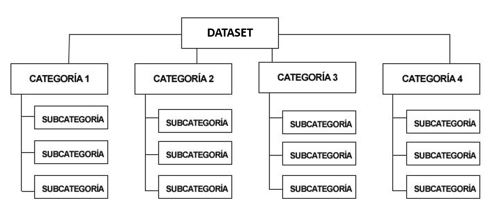
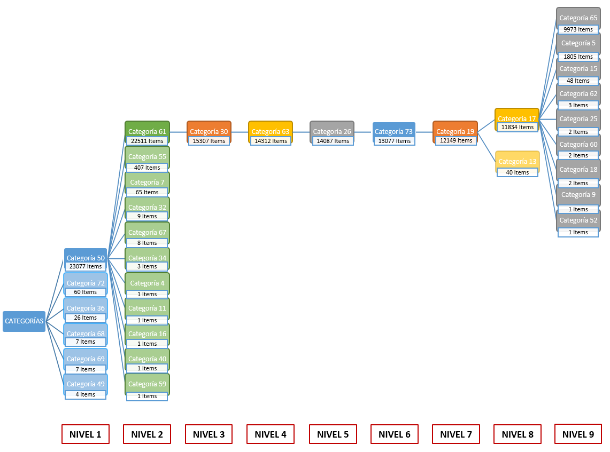
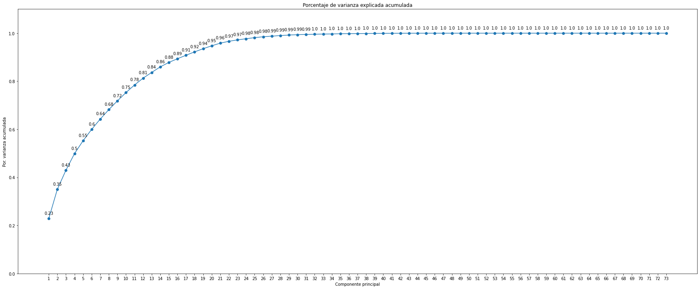
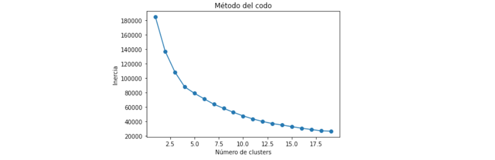
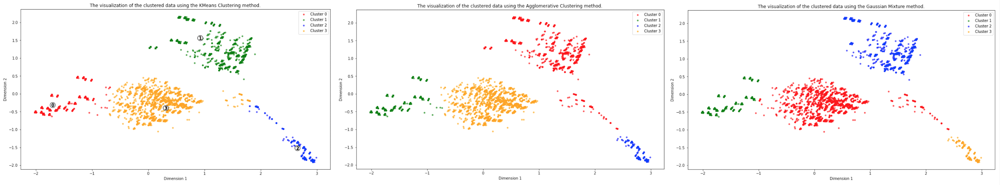
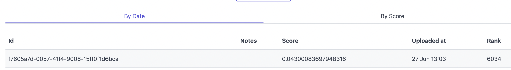

## TRABAJO FINAL DATA SCIENCE - UNIVERSITAT DE BARCELONA

> #### Integrantes: Joan Orellana Rios - Lucio Fabián Bolatti Fernández - Oriol Gilbert

> *__Nota__: En este GitHub Page describimos nuestro trabajo final de curso . El mismo se basa en el RecSys Challenge 2022 (http://recsyschallenge.com/2022), usando los mismos data sets y scorings del challenge.*

### Resumen:

En el presente trabajo, ajustamos varios algorítmos de machine learning (SGD Classifier, Decision Tree, K-nearest Neighbour, SVC y Random Forest Classifier) para predecir los 100 porductos más probables a ser comprados por un usuario dada una sesión. Para ello, es importante disponer de datos de calidad para entrenar el modelo y, para que así sea, lo  datos (podéis econtrarlos [aquí](https://www.dressipi-recsys2022.com)) estan previamente validados uno por la empresa porveedora del reto. En un primer lugar, haremos un EDA básico para sacar estadísticos elementales seguidamente de un proceso de feature engineering para dar más valor al dataset (se ajusta un modelo no supervisado para clústering y se crean variables adicionales). Finalmente, aplicamos diferentes algoritmos quedándonos con un clasificador Random Forest el cual tunearemos sus hiperparámetros para justar mejor el modelo y dar mejores predicciones.


<br>

### 1. Motivación

#### 1.1 ¿Por qué escogimos este proyecto?

En el presente curso, a los estudiantes se nos presento la oportunidad de escoger entre varias proyectos con los que demostrar nuestras hablidades. Nosotros, escogimos un proyecto presentado por [Dressipi](https://dressipi.com)<a name="fn-1"></a>[<sup>[1]</sup>](#fn-1) el cual nos presentaba un reto interesante, pues seria nuestro primer sistema de recomendacion basado en modelos de machine learning.  


#### 1.2 ¿Cuáles es el desafío?

El reto<a name="ref-1"></a>[<sup>[1]</sup>](#ref-1) que presenta Dressipi y que sirve para nuestro capstone project, se centra en las recomendaciones de moda. Cuando se dan sesiones de usuario, datos de compra y datos de contenido sobre los artículos, la pregunta que nos hacemos es... ¿se puede predecir con precisión qué artículo de moda que se compraran al final de la sesión?

Los datos de contenido consisten en etiquetas descriptivas de los artículos (como el color, la longitud, el escote, el estilo de las mangas, etc.). Las etiquetas se han asignado mediante el sistema human-in-the-loop de Dressipi, en el que expertos en moda revisan, corrigen y confirman la corrección de las etiquetas, por lo que los datos que presentas son datos de gran precisión y calidad. 


Es importante poder hacer recomendaciones que respondan a lo que el usuario está haciendo durante la sesión actual para crear una mejor experiencia que posiblemente se traduzca en una compra. 


#### 1.3 Conjunto de datos
Los datos publicados muestran un conjunto de datos de 1.1 millones de sesiones de venta en online (de 18 meses) que han dado lugar a una compra. Es importante saber que todos los artículos del conjunto de datos han sido etiquetados con datos de contenido, por lo que las etiquetas se nos han sido subministradas por parte de la empresa.

En estos datos vemos varias cosas:
 1. Como etiquetas se refieren a las características del artículo. 
 2. El conjunto de datos ha sido muestreado y anonimizado.

a parte de estos dos puntos, salen 3 definiciones de vital importancia:

* **Sesiones**: Los elementos que fueron vistos en una sesión. En este conjunto de datos, una sesión equivale a un día, por lo que una sesión es la actividad de un usuario en un día. Variables:
    * ```session_id```
    * ```item_id```
    * ```timestamp```
    
* **Compras**: La compra que se realizó al final de la sesión. Un artículo comprado por sesión.
    * ```session_id```
    * ```item_id```

* **Características de los artículos**: Los datos de la etiqueta de los artículos. Cosas como "color: verde", "escote: cuello de pico", etc.
    * ```item_id```
    * ```feature_category_id```
    * ```feature_value_id```
    


La imagen siguiente no es mas que una simple ilustración de cómo podrían ser los datos de caracteristicas de un vestido determinado. En el conjunto de datos, los datos de las etiquetas se han anonimizado mediante el uso de identificadores: en este caso, no obtendremos las etiquetas de texto claro como "escote: cuello de V/pico", sino identificadores que representan los mismos datos.


<br>

### 2. Análisis Exploratorio de Datos


En cualquier proyecto analítico, un mínimo de análisis descriptivo/exploratoria es requerido para entender el dato y decidir si es necearia alguna tecnica estadistica como la imputacion de datos faltantes, etcétera. 

#### 2.1 Datos Faltantes

Para todos los datasets provistos por Dressipi, ninguno de ellos contiene datos faltantes, por lo que no se requiere hacer ningunta imputación por la mediana (para datos desbalanceados) o media (para datos balanceados)

#### 2.1 Distribución de los datos 

Para empezar, los datos de sesiones están distribuidos de la siguiente forma:

* 95% para datos train
* 5% para datos validación

Representando casi 5M de registos totales. Esta cantidad es entonces un buen numero de datos para realizar un modelo de ML. Hay que tener en cuenta que con menores datos, menor informacion para el modelo.   

Siguiedo con las distribuciones, podemos ver que:
* Las compras se realizan en mayor medida durante la tarde-noche. 
* La categorias más comunes son la 47, 46 50 y 68. Por la cola econtramos las 9,13 y 27. Esto nos da a entender que cuanto más _común_ o _popular_ sea la caracteristica entre los items, menos determinara el objeto. Asimismo, cuanto más singular sea esa característica entre los items, más determinar el tipo de prenda/item.
* Se observa usuarios que buscan prendas muy elaboradas (sesiones con items complejos - muchas categorias por item-) y muchos usuarios con prendas menos elabroadas, con esto podemos ver un poco el perfil del usuario para determiar un poco hacia donde van los tiros en cuanto a items a predecir.

Resumen de la informacion para el conjunto de datos:

| Conjunto de datos   | Filas   | # Columnas                      | Datos Faltantes |
|---------------------|---------|-------------------------------|-----------------|
| item_features       | 471751  | 3 (se tratan com categóricas) | 0%              |
| train_purchases     | 1000000 | 3 (se tratan com categóricas) | 0%              |
| test_final_sessions | 226138  | 3 (se tratan com categóricas) | 0%              |
| train_sessions      | 4743820 | 3 (se tratan com categóricas) | 0%              |


> *__Nota__: Podéis encontrar más detalle sobre este apartado en el notebook "1_Analisis_Exploratorio_de_Datos" en el repositorio de este trabajo.*

<br>

### 3. Primer Análisis de los Datos e Intento de Armado de Arbol de Categorías

Comenzamos realizando un primer análisis de los datos, a partir del cual decidimos intentar realizar un Arbol de Categorías.

Dado que el trabajo abordado se trata de sesiones de compras de diversos productos, y categorías de estos productos, pensamos en los arboles de categorías que se suelen encontrar en la mayoría de las páginas de compras. A continuación se muestra un esquema que representan dicho arbol de categorías:



De esta manera, si lográramos recontruir dicho arbol de categorías a partir de los datos, se tendría una buena categorización de los items, la cual se podría utilizar en el entrenamiento de un modelo. Esto se podría representar de la siguiente manera:


Lamentablemente no se otubieron buenos resultados con este proceso, por lo cual se decidió descartarlo y proceder a realizar un Clustering. A continuación se muestra los resultados parciales, los cuales no poseen las características deseadas para un arbol de categorías descripto inicialmente.



>_**Nota**: Podéis encontrar más detalle con la correspondiente documentación en el siguente notebook: "Intento de Arbol de Clasificación - Documentado" en el repositorio de este trabajo_.

<br>

### 4. Análisis de las Componentes Principales (PCA)

Previo a la realización del Clustering, se realiza un Análisis de las Componenetes Principales (PCA por sus siglas en inglés). Esto permite reducir la dimensionalidad de los datos, es decir sus características (features). De esta manera se logra reducir la complexidad del problema (para el algoritmo) y los tiempos de cómputo.

El resultado obtenido fue de 16 componentes las cuales consiguen mantener un porcentaje de varianza explicada acumulada del casi el 90%, como se puede ver en el siguente gráfico:



>_**Nota**: Podéis encontrar más detalle con la correspondiente documentación en el siguente notebook: "PCA_Seleccion_Numero_Componentes" en el repositorio de este trabajo._

<br>

### 5. Clustering

A la información que se nos da de los ítems, intentamos extraer información sobre como podíamos agrupar los ítems, que pueda aportar valor al entrenamiento. Esto se realizó mediante un método de aprendizaje no supervisado, el clustering. En nuestro caso teníamos un conjunto de datos sobre los ítems que se venden que no estaban etiquetados. Si lo estuviesen, la agrupación se podría realizar mediante clasificación. Al no estarlo, tuvimos que encontrar las similaridades entre los distintos ítems según las categorías que presentan. Para el clustering solo tuvimos en cuenta la información sobre los ítems y categorias, pero no la información sobre los valores de las categorias. 

En primer lugar, se tiene que escoger que número de clusters es el óptimo para aplicar el método. El método del codo nos permite determinar este valor <a name="ref-2"></a>[<sup>[2]</sup>](#ref-2). Este método consiste en graficar la inercia en función del número de clusters, y ver donde se encuentra el codo - es decir, en que punto se encuentra el cambio de pendiente más notable de la curva - para determinar que valor usar.



Se puede ver un 'codo' con 4 clusters, por lo que ese fue el número de clusters que decidimos usar.

Decidimos escoger también el mejor método de clustering, entre tres posibles métodos:

- K-Means
- Agglomerative Clustering
- Gaussian Mixture

Para ello, visualizamos en formato gráfico 2D (graficando los datos reducidos a 2 componentes principales) los resultados de clustering usando cada uno de los métodos y estos fueron los resultados.



Podemos ver como los tres métodos nos dan resultados muy parecidos. Sin embargo, vemos una diferencia en como se interpreta el grupo de puntos que se encuentra en la esquina inferior derecha. A simple ojo se puede ver como hay un grupo de puntos alargado y estrecho que tanto el Agglomerative Clustering como el Gaussian Mixture consideran que pertenece a partes iguales a dos clusters distintos. El K-Means a diferencia de los otros dos métodos considera que la gran mayoría de puntos de ese grupo como un solo cluster. Eso nos hizo decidirnos por usar el método K-Means para el clustering. Cabe remarcar que el uso de 2 componentes principales para representar un conjunto de datos de forma gráfica no es ideal para sacar conclusiones ya que solo explica el 35% de la varianza de los datos.

Finalmente se ejecuta el clustering usando el método K-Means, con un 4 cluster y 16 componentes principales.

>_**Nota**: Podéis encontrar más detalle con la correspondiente documentación en el siguente notebook: "clustering_features" en el repositorio de este trabajo._

<br>

### 6. Feature Engineering

Además de la información proporcionada por el Clustering, se realizó un Feature Engineering para obtener otra información relevante para el entrenamiento del modelo.

En primer lugar se tiene información determinada a criterio de los integrantes del grupo, y se trata de la siguente:

- Primer producto visto
- Último producto visto
- Número total de productos vistos
- Categoria más vista en la sesión
- Número de categorias distintas vistas en la sesión
- Duración total de la sesión
- Tiempo medio dedicado a cada producto
- Período del día en el cual la sesión comenzó (madrugada, día, tarde o noche)

Por otra parte, tras la información obtenido mediante el método de clustering, de cada sesión se determinó:

- Número de productos vistos para cada cluster (una columna por cluster)
- Cluster más visto
- Cluster al que pertenece el primer producto visto
- Cluster al que pertenece el último producto visto

Y así quedó el dataset final:

| session_id	| first_prod | last_prod | prod_count | most_common_cat | count_num_unique_cat | time_diff | time_per_prod | time_first_prod | 0 | 1 | 2 | 3 | most_seen_cluster | first_item_cluster	| last_item_cluster |
| --- | --- | --- | --- | --- | --- | --- | --- | --- | --- | --- | --- | --- | --- | --- | --- |
| 3	| 9655	| 9655	| 2	| 2	| 18	| 312	| 156	| noche	| 0.0	| 0.0	| 2.0 |	0.0	| 2 | 2 | 2 |

### 7. Preprocesamiento de los datos

Para que el modelo pueda entender las variables categóricas, es necesario codificarlas previamente, para lo cual se aplicó un One Hot Encoder. 
<br>

### 8. Entrenamiento y Selección del Modelo

Una vez listo el dataset, se pasó al entrenamiento y selección del mejor modelo. Para ello se evaluaron diversos modelos:

- SGD Classifier
- Decision Tree
- K-nearest Neighbour
- SVC
- Random Forest Classifier

Probamos cada modelo utilizando el método de Mean Reciprocal Rank. Es el que se utiliza en el concurso RecSys Challenge. Esto nos ayudó a elegir el modelo más adecuado.

**Cálculo del MRR**

El rango recíproco medio (Mean Reciprocal Rank) es una medida estadística para evaluar cualquier proceso que produzca una lista de posibles respuestas a una muestra de consultas, ordenadas por probabilidad de corrección. El rango recíproco de una respuesta a una consulta es el inverso multiplicativo del rango de la primera respuesta correcta: 1 para el primer puesto, 1⁄2 para el segundo, 1⁄3 para el tercero y así sucesivamente. El rango recíproco medio es la media de los rangos recíprocos de los resultados de una muestra de consultas

$$ MRR = \frac{1}{| Q |} \displaystyle\sum_{i=1}^{| Q |} \frac{1}{rank_i} $$

donde $\displaystyle {\text{rank}}_{i}$ hace referencia a la posición de rango del primer documento relevante para la consulta i-ésima.

**Tabla de resultados**

Classifier | Number of Sessions | Mean Reciprocal Rank | Training Time |
| --- | --- | --- | --- |
SGD | 11172 | 0.026005918927187604 | 17s 300s |
KNN | 11172 | 0.016126264214551485 | 200ms |
SVC | 11172 | 0.015471577711113993 | 2min 51s 800ms |
Decision Tree | 11172 | 0.010970834404048573 | 17s 900ms |
Random Forest | 11172 | 0.03393014598889391 | 18s 900ms |

Basándonos en los resultados que se obtuvieron para cada clasificador, podemos ver que los que obtuvieron los mejores resultados fueron el SGD Classifier y el Random Forest Classifier. El SGD Classifier y el Random Forest Classifier, si bien tienen un tiempo de entrenamiento muy parecido, difieren de forma notable en el valor del MRR. Es por eso que finalmente se optó por usar el Random Forest Classifier, al tener el MRR más elevado.

<br>

### 9. Mejores Parámetros (REVISARRRRRR)

VER QUE PONER ACAAAAAA

### 10. Feature Importance (REVISARRRRRR)

VER QUE PONER ACAAAAA

### 11. Generación del archivo Test Submission

Por último, utilizando el modelo descripto y todo lo anterior, se analiza el dataset de "test_leaderboards_session", y se genera el archivo de entrega "final_submission", el cual es el resultado final de este trabajo.

Este fue el último intento antes de entregar el trabajo (captura de la página web de la competición https://www.dressipi-recsys2022.com/)




## Conclusiones (REVISARRRRRR)

---------------------------------------------------------------------------------------------------------------


##### Notas

<a name="fn-1"></a>1. [^](#fn-1) _Dressipi_ es un experto en inteligencia artificial de la moda que ofrece recomendaciones de productos y ropa a los principales minoristas del mundo. Sus recomendaciones permiten a los minoristas crear nuevas experiencias de descubrimiento de productos que son personalizadas e inspiradoras y que pueden utilizarse en todos los pasos del recorrido del comprador. Comentan que sus algoritmos permiten a los minoristas tomar mejores decisiones de compra y comercialización al prever con mayor precisión la demanda de productos y las proporciones de tamaño. En tal caso, su objetivo es ofrecer las mejores recomendaciones y predicciones de ropa del mundo. Dressipi trabaja con marcas de Estados Unidos, Reino Unido, Europa y Australia.


##### Referencias


<a name="ref-1"></a>\[1\].  [^](#ref-1) [RecSys Challenge 2022](http://www.recsyschallenge.com/2022/), Dressipi, Bruce Ferwerda (Jönköping University, Sweden), Saikishore Kalloori (ETH Zürich, Switzerland), and Abhishek Srivastava (IIM Jammu, India).

<a name="ref-2"></a>\[2\].  [^](#ref-2) Kodinariya, T. M., & Makwana, P. R. (2013). Review on determining number of Cluster in K-Means Clustering. International Journal, 1(6), 90-95.


<br>

<br>

<br>


<br>

<br>

<br>


<!--


Markdown is a lightweight and easy-to-use syntax for styling your writing. It includes conventions for

```markdown
Syntax highlighted code block

# Header 1
## Header 2
### Header 3

- Bulleted
- List

1. Numbered
2. List

**Bold** and _Italic_ and `Code` text

[Link](url) and 
```

For more details see [Basic writing and formatting syntax](https://docs.github.com/en/github/writing-on-github/getting-started-with-writing-and-formatting-on-github/basic-writing-and-formatting-syntax).

### Jekyll Themes

Your Pages site will use the layout and styles from the Jekyll theme you have selected in your [repository settings](https://github.com/LucioBolatti/RecSys22-UB/settings/pages). The name of this theme is saved in the Jekyll `_config.yml` configuration file.

### Support or Contact


Having trouble with Pages? Check out our [documentation](https://docs.github.com/categories/github-pages-basics/) or [contact support](https://support.github.com/contact) and we’ll help you sort it out.


  -->
  
