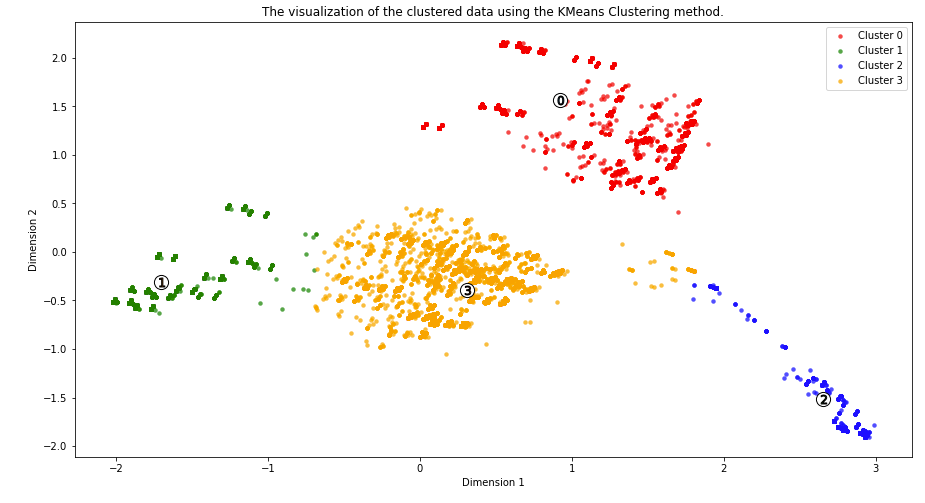
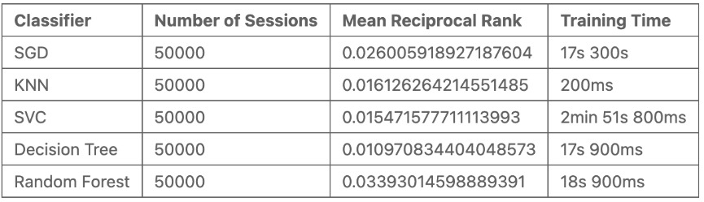

## TRABAJO FINAL DATA SCIENCE - UNIVERSITAT DE BARCELONA

> #### Integrantes: Joan Orellana Rios - Lucio Fabián Bolatti Fernández - Oriol Gilbert

> *__Nota__: En este GitHub Page describimos nuestro trabajo final de curso . El mismo se basa en el RecSys Challenge 2022 (http://recsyschallenge.com/2022), usando los mismos data sets y scorings del challenge.*

### Resumen:

En el presente trabajo, ajustamos un modelo (o _x_ modelos) para predecir los 100 primeros items de posibles compras para un usuario dada su sesión de visualización de items. Es importante tanto para el comprador como para el vendedor dar un recomendación ajustada a afín a sus gustos. Para ello, usamos datos provistos por esta misma compañia (podéis econtrarlos [aquí](https://www.dressipi-recsys2022.com)) para entrenar un modelo Random Forest i un lienal como baseline.  Finalmente, veremos que el modelo que mejor predice es el Random Forest.


<br>

### 1. Motivación

#### 1.1 ¿Por qué escogimos este proyecto?

En el presente curso, a los estudiantes se nos presento la oportunidad de escoger entre varias proyectos con los que demostrar nuestras hablidades. Nosotros, escogimos un proyecto presentado por [Dressipi](https://dressipi.com)<a name="fn-1"></a>[<sup>[1]</sup>](#fn-1) el cual nos presentaba un reto interesante, pues seria nuestro primer sistema de recomendacion basado en modelos de machine learning.  


#### 1.2 ¿Cuáles es el desafío?

El reto<a name="ref-1"></a>[<sup>[1]</sup>](#ref-1) que presenta Dressipi y que sirve para nuestro capstone project, se centra en las recomendaciones de moda. Cuando se dan sesiones de usuario, datos de compra y datos de contenido sobre los artículos, la pregunta que nos hacemos es... ¿se puede predecir con precisión qué artículo de moda que se compraran al final de la sesión?

Los datos de contenido consisten en etiquetas descriptivas de los artículos (como el color, la longitud, el escote, el estilo de las mangas, etc.). Las etiquetas se han asignado mediante el sistema human-in-the-loop de Dressipi, en el que expertos en moda revisan, corrigen y confirman la corrección de las etiquetas, por lo que los datos que presentas son datos de gran precisión y calidad. 


Es importante poder hacer recomendaciones que respondan a lo que el usuario está haciendo durante la sesión actual para crear una mejor experiencia que posiblemente se traduzca en una compra. 


#### 1.3 Conjunto de datos
Los datos publicados muestran un conjunto de datos de 1.1 millones de sesiones de venta en online (de 18 meses) que han dado lugar a una compra. Es importante saber que todos los artículos del conjunto de datos han sido etiquetados con datos de contenido, por lo que las etiquetas se nos han sido subministradas por parte de la empresa.

En estos datos vemos varias cosas:
 1. Como etiquetas se refieren a las características del artículo. 
 2. El conjunto de datos ha sido muestreado y anonimizado.

a parte de estos dos puntos, salen 3 definiciones de vital importancia:

* **Sesiones**: Los elementos que fueron vistos en una sesión. En este conjunto de datos, una sesión equivale a un día, por lo que una sesión es la actividad de un usuario en un día. Variables:
    * ```session_id```
    * ```item_id```
    * ```timestamp```
    
* **Compras**: La compra que se realizó al final de la sesión. Un artículo comprado por sesión.
    * ```session_id```
    * ```item_id```

* **Características de los artículos**: Los datos de la etiqueta de los artículos. Cosas como "color: verde", "escote: cuello de pico", etc.
    * ```item_id```
    * ```feature_category_id```
    * ```feature_value_id```
    


La imagen siguiente no es mas que una simple ilustración de cómo podrían ser los datos de caracteristicas de un vestido determinado. En el conjunto de datos, los datos de las etiquetas se han anonimizado mediante el uso de identificadores: en este caso, no obtendremos las etiquetas de texto claro como "escote: cuello de V/pico", sino identificadores que representan los mismos datos.


<br>

### 2. Análisis Exploratorio de Datos


En cualquier proyecto analítico, un mínimo de análisis descriptivo/exploratoria es requerido para entender el dato y decidir si es necearia alguna tecnica estadistica como la imputacion de datos faltantes, etcétera. 

#### 2.1 Datos Faltantes

Para todos los datasets provistos por Drepessi, ninguno de ellos contiene datos faltantes, por lo que no se requiere hacer ningunta imputación por la mediana (para datos desbalanceados) o media (para datos balanceados)

#### 2.1 Distribución de los datos 

Para empezar, los datos de sesiones están distribuidos de la siguiente forma:

* 95% para datos train
* 5% para datos validación

Representando casi 5M de registos totales. Esta cantidad es entonces un buen numero de datos para realizar un modelo de ML. Hay que tener en cuenta que con menores datos, menor informacion para el modelo.   

Siguiedo con las distribuciones, podemos ver que:
* Las compras se realizan en mayor medida durante la tarde-noche. 
* La categorias mas comunes son la 47, 46 50 y 68. Por la cola econtramos las 9,13 y 27. Esto nos da a entender que cuanto más _común_ o _popular_ sea la caracteristica entre los items, menos determinara el objeto. Asimismo, cuanto más singular sea esa característica entre los items, más determinar el tipo de prenda/item.
* Se observan muchos items con muchas carctristicas y muchos item con categorias muy pocas categorias


<br>

### 3. Primer Análisis de los Datos e Intento de Armado de Arbol de Categorías

Comenzamos realizando un primer análisis de los datos, a partir del cual decidimos intentar realizar un Arbol de Categorías.

Dado que el trabajo abordado se trata de sesiones de compras de diversos productos, y categorías de estos productos, pensamos en los arboles de categorías que se suelen encontrar en la mayoría de las páginas de compras. A continuación se muestra un esquema que representan dicho arbol de categorías:


De esta manera, si lográramos recontruir dicho arbol de categorías a partir de los datos, se tendría una buena categorización de los items, la cual se podría utilizar en el entrenamiento de un modelo. Esto se podría representar de la siguiente manera:


Dicho proceso y su correspondiente documentación se puede encontrar en el código "Intento de Arbol de Clasificación - Documentado" en el repositorio de este trabajo.

Lamentablemente no se otubieron buenos resultados con este proceso, por lo cual se decidió descartarlo y proceder a realizar un Clustering. A continuación se muestra los resultados parciales, los cuales no poseen las características deseadas para un arbol de categorías descripto inicialmente.


<br>

### 4. Análisis de las Componentes Principales (PCA)

Previo a la realización del Clustering, se realiza un Análisis de las Componenetes Principales (PCA por sus siglas en inglés). Esto permite reducir la dimensionalidad de los datos, es decir sus características (features). De esta manera se logra reducir la complexidad del problema (para el algoritmo) y los tiempos de cómputo.

El resultado obtenido fue de 16 componentes las cuales consiguen mantener un porcentaje de varianza explicada acumulada del casi el 90%, como se puede ver en el siguente gráfico:


El proceso realizado en detalle y correspondiente documentación se puede en el código "PCA_Seleccion_Numero_Componentes" en el repositorio de este trabajo.


<br>

### 5. Clustering

A partir del resultado del PCA (16 componenetes principales) de realiza un clustering de los datos con diversos métodos.

Luego de varios intentos y análisis, se obtuvo como mejor resultado un total de 4 clusters, que se utilizan para los posteriores pasos. Esto se puede ver graficamente en la siguiente imagen:



El detalle de esto y su correspondiente documentación se puede en el código "clustering_features" en el repositorio de este trabajo.

<br>

### 6. Feature Engineering (REVISARRRRRR)

Además de la información proporcionada por el Clustering, se realizó un Feature Engineering para obtener otra información relevante para el entrenamiento del modelo.

En primer lugar se tiene información determinada a criterio de los integrantes del grupo, y se trata de la siguente:

- Primer producto visto en la sesión
- Momento en el que el primer producto es visto
- Último producto visto en la sesión
- Momento en el que el último producto es visto
- Duración total de la sesión
- Tiempo promedio utilizado en cada producto
- Período del día en el cual la sesión comenzó (madrugada, día, tarde o noche)


#### 6.1. Purchases (REVISARRRRRR)

Con respecto a los datos de las compras, se extrajo el item comprado y la hora de la compra.

#### 6.2. Features (REVISARRRRRR)

Por otra parte, de cada sesión se determinó:

- Veces que se vió cada cluster
- Cluster más visto

#### 6.3 Combinación de todos los datos (REVISARRRRRR)

Por último, se combió todo lo anterior en un mismo dataset que, luego de algunos procesamientos más, es el utilizado como información de entrada para el entrenamiento del modelo.

<br>

### 7. División en Train y Test

Previo a realizar los siguientes procesamiento de los datos, se realiza la división en train y test.

<br>

### 8. Preparación de los Datos para los Algoritmos de Machine Learning (REVISARRRRRR)

Para poder utilizar el dataset en el entramiento del modelo, es necesario realizar una serie de procesamientos con las variables categóricas, para lo cual se realizó un Ordinal Encoder y un Pipeline

COREGIRRRRRRRRRRRRRRRRR

<br>

### 9. Entrenamiento y Selección del Modelo

Una vez listo el data set, se pasó al entramiento y selección del mejor modelo. Para ello se entrenaron divsersos modelos, los cuales son:

- SGD CLassifier
- Decision Tree
- K-nearest Neighbour
- SVC
- Random Forest Classifier

Una vez entrenados todos los modelos listados, se utiliza el método de la media recíproca para determinar cual es el mejor, ya que este es el método utilizado en el chalenge.

Como resultado, se determina que el mejor modelo a utilizar es el Random Forest Classifier, y con el cual se trabajó en los pasos posteriores. En la siguente tabla se resumen los resultados obtenidos:



<br>

### 10. Mejores Parámetros (REVISARRRRRR)

VER QUE PONER ACAAAAAA

### 11. Feature Importance (REVISARRRRRR)

VER QUE PONER ACAAAAA

### 12. Generación del archivo Test Submission (REVISARRRRRR)

Por último, utilizando el modelo descripto y todo lo anterior, se analiza el dataset de "test_final", y se genera el archivo de entrega "final_submission", el cual es el resultado final de este trabajo.


Todo esto en detalle y su correspondiente documentación se puede en el código "ALL_Joan" en el repositorio de este trabajo.


## Conclusiones (REVISARRRRRR)

---------------------------------------------------------------------------------------------------------------


##### Notas

<a name="fn-1"></a>1. [^](#fn-1) _Dressipi_ es un experto en inteligencia artificial de la moda que ofrece recomendaciones de productos y ropa a los principales minoristas del mundo. Sus recomendaciones permiten a los minoristas crear nuevas experiencias de descubrimiento de productos que son personalizadas e inspiradoras y que pueden utilizarse en todos los pasos del recorrido del comprador. Comentan que sus algoritmos permiten a los minoristas tomar mejores decisiones de compra y comercialización al prever con mayor precisión la demanda de productos y las proporciones de tamaño. En tal caso, su objetivo es ofrecer las mejores recomendaciones y predicciones de ropa del mundo. Dressipi trabaja con marcas de Estados Unidos, Reino Unido, Europa y Australia.


##### Referencias


<a name="ref-1"></a>\[1\].  [^](#ref-1) [RecSys Challenge 2022](http://www.recsyschallenge.com/2022/), Dressipi, Bruce Ferwerda (Jönköping University, Sweden), Saikishore Kalloori (ETH Zürich, Switzerland), and Abhishek Srivastava (IIM Jammu, India).


<br>

<br>

<br>


<br>

<br>

<br>


Markdown is a lightweight and easy-to-use syntax for styling your writing. It includes conventions for

```markdown
Syntax highlighted code block

# Header 1
## Header 2
### Header 3

- Bulleted
- List

1. Numbered
2. List

**Bold** and _Italic_ and `Code` text

[Link](url) and 
```

For more details see [Basic writing and formatting syntax](https://docs.github.com/en/github/writing-on-github/getting-started-with-writing-and-formatting-on-github/basic-writing-and-formatting-syntax).

### Jekyll Themes

Your Pages site will use the layout and styles from the Jekyll theme you have selected in your [repository settings](https://github.com/LucioBolatti/RecSys22-UB/settings/pages). The name of this theme is saved in the Jekyll `_config.yml` configuration file.

### Support or Contact

Having trouble with Pages? Check out our [documentation](https://docs.github.com/categories/github-pages-basics/) or [contact support](https://support.github.com/contact) and we’ll help you sort it out.
